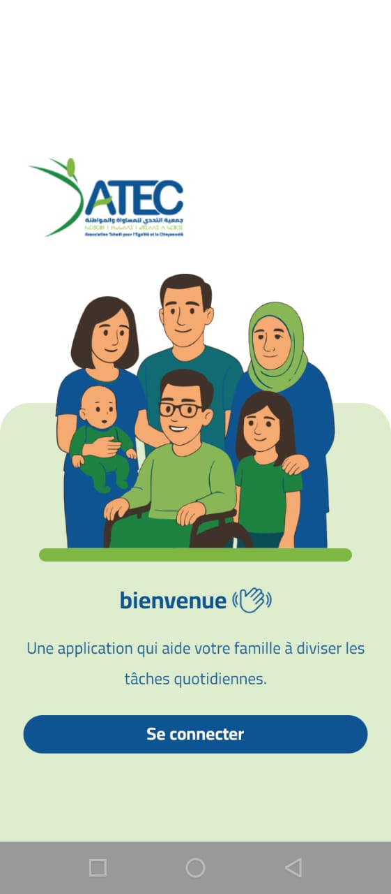
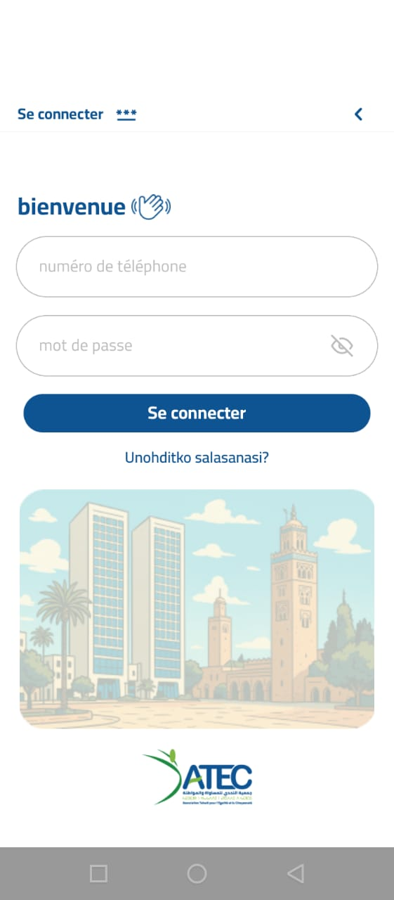
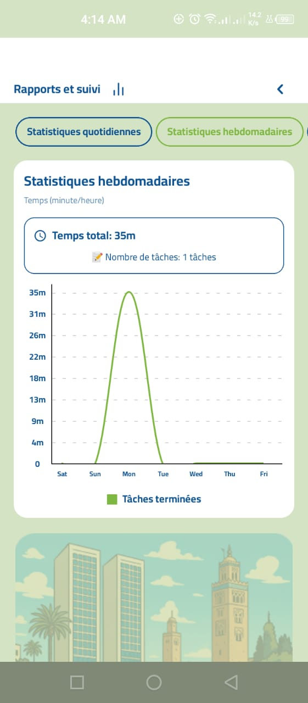
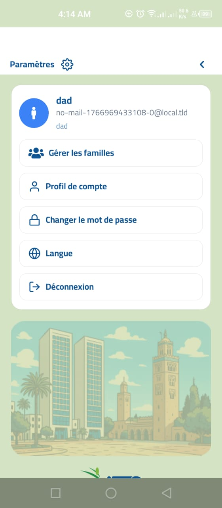

# Family Task Management Platform

A full-stack platform that helps families organize tasks, track progress, and view clear reports — powered by a React Native mobile app and a Laravel backend.

## Project Overview

This repository contains a real, client-delivered application composed of:

- A cross-platform mobile app (iOS/Android) for end users
- A backend API + web dashboard for administration and reporting

### Delivered Capabilities (High Level)

- Family & member management
- Task creation, assignment, and completion tracking
- Notifications (mobile push) and email workflows
- Multi-language support (Arabic RTL, English, French)
- Reporting and exports (PDF / Excel)
- Clean, modular code structure for long-term maintainability

## Links

- Web Dashboard: https://nte9asmoch9a.com
- Google Play (Android): https://play.google.com/store/apps/details?id=com.xcodes.nte9asmoCh9a
- App Store (iOS): https://apps.apple.com/app/com.xcodes.nte9asmoCh9a

## 📱 Application Screenshots

Experience the intuitive and modern interface designed for seamless family task management:

<p align="center">
  
  
  
  
  
</p>

### Interface Features

- **Clean & Modern Design**: Intuitive user interface
- **Multi-Language**: Seamless switching between Arabic (RTL), French
- **Responsive Layout**: Optimized for all screen sizes and orientations
- **Visual Analytics**: Charts and statistics for progress tracking

---

## 🌟 Platform Overview

A modern solution designed to bring families together through organized task management, progress tracking, and meaningful engagement. This platform combines powerful mobile capabilities with robust backend infrastructure.

### Platform Components

**📱 Mobile Application**

- Native iOS and Android experience
- Real-time synchronization
- Offline functionality
- Push notifications
- Beautiful UI/UX

**🌐 Web Dashboard**

- Administrative control panel
- Advanced analytics
- Data export tools
- Multi-user management
- Regional organization

---

## ✨ Key Features

- **Multi-Language Support**: Full RTL support for Arabic, plus English and French
- **Family & Member Management**: Organize families and track all members
- **Task Assignment & Tracking**: Create, assign, and monitor task completion with time tracking
- **Analytics & Reports**: Comprehensive daily, weekly, and overall statistics with visual charts
- **Gamification System**: Points and achievements to encourage participation
- **Push Notifications**: Real-time reminders and updates
- **Advanced Filtering**: Search by region, city, age group, date range
- **Export Capabilities**: Generate professional PDF and Excel reports
- **Offline Support**: Graceful degradation with network status awareness

---

## 📱 Mobile Application

### Technology Stack

- **Framework**: React Native with Expo
- **Navigation**: React Navigation (Native Stack)
- **State Management**: Custom hooks with AsyncStorage
- **Charts & Visualization**: React Native Gifted Charts
- **Internationalization**: i18next with RTL support
- **Notifications**: Expo Notifications + Firebase Cloud Messaging

### Architecture

Clean modular architecture with separation of concerns:

```
app/
├── android/                    # Android native project
├── ios/                        # iOS native project
├── assets/                     # Static assets and images
│   └── tasks/                 # Task-related media
├── src/
│   ├── components/            # Reusable UI components
│   ├── screens/               # Screen-level components
│   │   ├── Auth/              # Authentication flows
│   │   └── dashboard/         # Main application screens
│   ├── hooks/                 # Custom React hooks
│   ├── lang/                  # Internationalization
│   │   └── locales/
│   │       ├── ar/           # Arabic translations
│   │       └── fr/           # French translations
│   ├── navigation/           # Navigation configuration
│   ├── config/               # Application configuration
│   ├── state/                # Global state management
│   └── utils/                # Utility functions
├── App.js                     # Application entry point
├── index.js                   # Root component
├── package.json              # Dependencies
├── eas.json                  # Expo Application Services config
└── app.json                  # Expo configuration
```

### Core Modules

#### Components

Reusable UI elements built with React Native components:

- **Cards**: Display tasks, families, and report summaries
- **Modals**: Interactive forms for adding/editing data
- **Status Indicators**: Network status, achievements, badges

#### Hooks

Custom React hooks encapsulating business logic:

- **Data Fetching**: API integration for families, tasks, and reports
- **Authentication**: Secure token storage and management
- **Notifications**: Push notification registration and handling
- **Network**: Online/offline detection and guards

#### Screens

Route-level views orchestrating components and hooks:

- **Authentication Flow**: Login, OTP verification, password reset
- **Dashboard**: Task management, family profiles, notifications
- **Reports**: Daily, weekly, and overall analytics with charts

#### Utils

Pure functions for computations and transformations:

- **Report Calculations**: Aggregate statistics from family and task data
- **Time Tracking**: Calculate duration and progress metrics

---

## 🌐 Web API & Admin Dashboard

### Technology Stack

- **Framework**: Laravel 12
- **PHP Version**: 8.2
- **Database**: MySQL/MariaDB
- **PDF Generation**: mPDF with custom styling
- **Excel Export**: PhpSpreadsheet
- **Frontend**: Blade templates with modern JavaScript
- **Device Detection**: Jenssegers Agent

### Architecture

```
api/
├── app/
│   ├── Console/
│   │   └── Commands/         # Custom artisan commands
│   ├── Exceptions/           # Custom exception handlers
│   │   ├── ApiException.php
│   │   └── ApiHandler.php
│   ├── Http/
│   │   ├── Controllers/      # Request handlers
│   │   │   └── admin/       # Admin panel controllers
│   │   ├── Middleware/      # Request filtering
│   │   ├── Requests/        # Form validation
│   │   └── Responses/       # API response formatting
│   ├── Mail/                # Email templates
│   │   └── AccountVerification.php
│   ├── Models/              # Database models
│   │   └── (Family/User/Task/Notification models)
│   ├── Providers/           # Service providers
│   │   └── AppServiceProvider.php
│   └── Traits/              # Reusable traits
│       ├── GeneratesAchievements.php
│       └── SendsAccountVerification.php
├── database/
│   ├── migrations/          # Database schema
│   ├── seeders/            # Data seeders
│   └── factories/          # Model factories
├── resources/
│   ├── views/              # Blade templates
│   │   ├── dashboard/     # Admin interface
│   │   └── exports/       # PDF templates
│   └── lang/               # Translations
│       ├── ar/            # Arabic
│       ├── en/            # English
│       └── fr/            # French
├── routes/
│   ├── api.php            # API endpoints
│   ├── web.php            # Web routes
│   └── console.php        # CLI commands
├── storage/
│   ├── app/               # Application files
│   ├── framework/         # Framework cache
│   └── logs/              # Application logs
├── public/
│   ├── index.php          # Entry point
│   └── frontend/          # Compiled assets
├── composer.json          # PHP dependencies
├── package.json           # Node dependencies
└── artisan                # Laravel CLI tool
```

### Core Features

#### Family Management System

- Create and manage family profiles
- Track members with detailed information
- Regional organization (city, region)
- Age group categorization

#### Task Management

- Assign tasks to families
- Track completion status
- Time-based monitoring
- Priority and deadline management

#### User Management

- User authentication and authorization
- Email verification system
- Role-based access control
- Device token management for push notifications

#### Notification System

- App notifications
- Push notifications to mobile devices
- Notification history and read status

#### Advanced Filtering

- Filter by region and city
- Date range filtering (year, month, day)
- Age group filtering
- Full-text search
- Combined multi-filter queries

#### Export & Reporting

- **Excel Export**: Filtered data exported to .xlsx format
- **PDF Generation**: Professional reports with:
  - Custom gradient headers
  - Brand color scheme
  - Filter information display
  - Statistical summaries
  - Color-coded task status
  - Professional footer

#### Localization

- Three-language support (Arabic RTL, English, French)
- Localized routes and URLs
- Dynamic content translation
- Date and time formatting per locale

## 🎯 Clean Code Principles

### Mobile App

- **Separation of Concerns**: UI, business logic, and side effects are isolated
- **Component Reusability**: Modular components with props-based configuration
- **Custom Hooks**: Encapsulated data fetching and state management
- **Pure Functions**: Utility functions with no side effects for easy testing
- **Localization-First**: All user-facing strings managed through i18n
- **Defensive Programming**: Network guards and error boundaries

### Backend API

- **MVC Architecture**: Clear separation of routes, controllers, and models
- **Form Requests**: Validation separated from controllers
- **API Responses**: Consistent response formatting
- **Middleware**: Cross-cutting concerns handled centrally

---

## 📊 Data Flow

### Mobile App → API

1. User interacts with mobile app UI
2. Custom hooks make authenticated API requests
3. Laravel backend processes and validates
4. Response formatted through API resources
5. App updates UI with new data

### Admin Dashboard → Database

1. Admin performs operations via web interface
2. Controllers validate and process requests
3. Models interact with database
4. Results returned to views
5. Export operations generate files

---

## 🔒 Security (High Level)

- Email verification flow
- Standard Laravel web protections (CSRF for web routes, ORM-based query safety)
- CORS configuration for API access

---

## 🌍 Multi-Language Support

### Supported Languages

- **Arabic (العربية)**: Full RTL support
- **English**: Default LTR language
- **French (Français)**: Additional language support

### Features

- Runtime language switching
- Localized routes
- Translated UI elements
- Date and number formatting
- RTL/LTR layout adaptation

---

## 📈 Analytics & Reporting

### Mobile App Reports

- **Daily Reports**: Task completion for current day
- **Weekly Reports**: 7-day performance overview
- **Overall Statistics**: Total achievements and progress
- **Visual Charts**: Bar and line charts for trend analysis
- **Time Tracking**: Duration spent on each task

### Admin Dashboard

- Family statistics
- Member demographics
- Task completion rates
- Regional distribution
- Time-based trends
- Export capabilities for data analysis

---

## 📦 Integrations

- Push notifications: Expo Notifications + Firebase configuration
- Email: Laravel Mail
- Exports: PDF generation + Excel spreadsheets

---

## 💡 Use Cases

### For Families

- Organize daily household tasks
- Track children's responsibilities
- Monitor progress and achievements
- Encourage participation through gamification
- Stay connected with notifications

### For Organizations

- Community task coordination
- Educational institution projects
- Non-profit volunteer management
- Social programs tracking
- Regional initiatives monitoring

---

## 🎯 Why This Platform?

### Modern Technology Stack

Built with the latest and most reliable technologies ensuring performance, scalability, and maintainability.

### Clean Code Architecture

Following SOLID principles and design patterns making the codebase easy to understand, extend, and maintain.

### Production Ready

Tested and validated with real-world usage scenarios, ready for deployment and scaling.

### User Centric

Intuitive interface, smooth animations, and thoughtful UX design ensuring great user experience.

## Summary

Family Task Management Platform combines a polished mobile experience with a capable backend (auth, localization, exports, notifications) to deliver a clear and maintainable solution for real-world family coordination.
